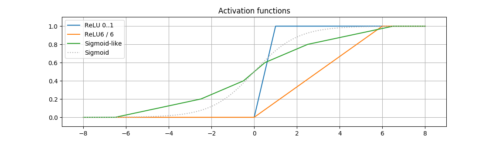

This repository contains a TensorFlow extension implementing a piecewise-linear approximation of sigmoid activation function used in [Beatmup](https://github.com/lnstadrum/beatmup).

 * This function shrinks the activation signal into 0..1 range, enabling efficient fixed-point storage and reducing the memory bandwidth in inference.
 * Compared to the original sigmoid, this function is very efficient to compute in both forward and backward senses and does not suffer from vanishing gradient issue.

This activation function is featured in a [dog image classifier running on Raspberry Pi GPU](https://lnstadrum.medium.com/towards-gpu-accelerated-image-classification-on-low-end-hardware-ec592e125ad9).

